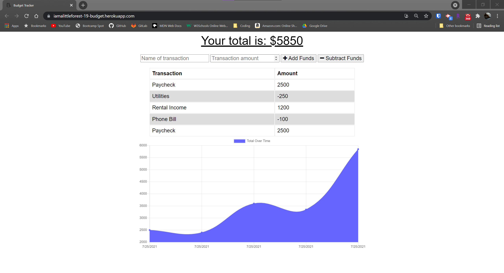

# Progressive Budget

## Link
https://iamalittleforest-19-budget.herokuapp.com/

## Languages & Technologies
* HTML / CSS / Javascript
* Compression
* Express
* Lite-server
* Mongoose 
* Morgan 
* Heroku 
* MongoDB Atlas

## Description
Budget Tracker is an application that enables a user to add expenses and deposits to their budget. The application is able to be accessed offline and will populate the total when the connection is reestablished.

## Screenshot

## License
MIT License

## Contact Information
Wendy Kobayashi 
* Email: <wykobayashi@gmail.com>
* LinkedIn: <https://www.linkedin.com/in/wendy-kobayashi/>